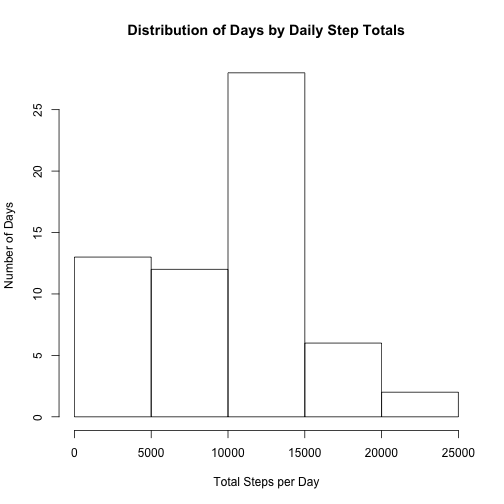
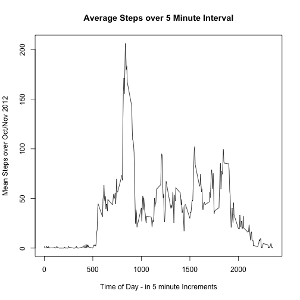
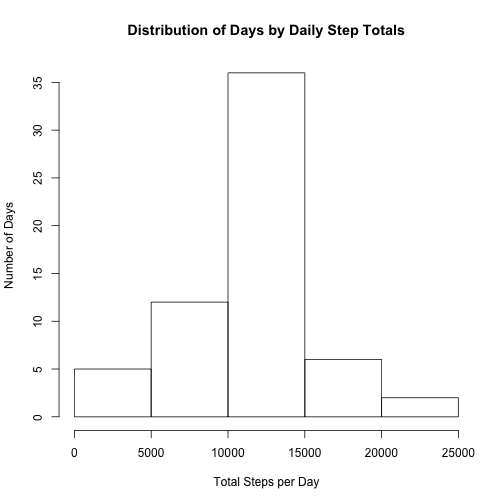
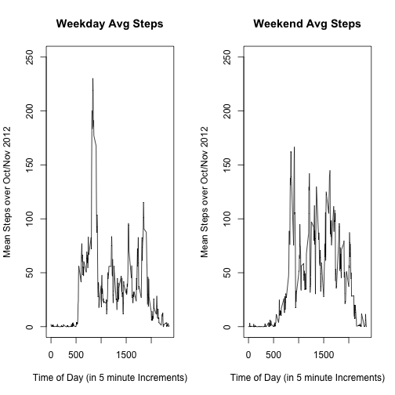

# Reproducible Research - Peer Assessment 1
## pmccullo October 2014
========================================================

The code and outputs below are my submission for the first project in the 
Coursera Reproducible Research class. All steps were taken to comply with 
project instructions. 

The code will answer 4 questions/problems as outlined in the instructions:

1. Mean number of steps taken per day
2. Average daily activity pattern
3. Imput missing values using a statistical approach
4. Are there differences in activity on weekdays and weekends

**The following information is directly from the project instructions:**

*This assignment makes use of data from a personal activity monitoring device.* 
*This device collects data at 5 minute intervals through out the day. The data*
*consists of two months of data from an anonymous individual collected during*
*the months of October and November, 2012 and include the number of steps taken* 
*in 5 minute intervals each day.*

*Data*

*The variables included in this dataset are:*
*steps: Number of steps taking in a 5-minute interval (missing values are coded*
*as NA) date: The date on which the measurement was taken in YYYY-MM-DD format*
*interval: Identifier for the 5-minute interval in which measurement was taken*
*The dataset is stored in a comma-separated-value (CSV) file and there are a*
*total of 17,568 observations in this dataset.*

**Step 1 will be to download the Data**


```r
  filename <- c("./repdata-data-activity.zip")
  url <- c("https://d396qusza40orc.cloudfront.net/repdata%2Fdata%2Factivity.zip")
  download.file(url,destfile = filename, method = "curl")
  unzip(filename)
```

**Step 2 will be to load the data, load packages, and prepare for analysis**


```r
  library(reshape2) #used to create tidier data frames as needed
  library(plyr) #used to calculate over data frames

  activitydata_OG <- read.csv("./activity.csv")
  summary(activitydata_OG)
```

```
##      steps                date          interval     
##  Min.   :  0.00   2012-10-01:  288   Min.   :   0.0  
##  1st Qu.:  0.00   2012-10-02:  288   1st Qu.: 588.8  
##  Median :  0.00   2012-10-03:  288   Median :1177.5  
##  Mean   : 37.38   2012-10-04:  288   Mean   :1177.5  
##  3rd Qu.: 12.00   2012-10-05:  288   3rd Qu.:1766.2  
##  Max.   :806.00   2012-10-06:  288   Max.   :2355.0  
##  NA's   :2304     (Other)   :15840
```
  
**Step 3 is to answer the Mean Number of steps per day**

from Coursera:

*For this part of the assignment, you can ignore the missing values in the*
*dataset.*
*Make a histogram of the total number of steps taken each day*
*Calculate and report the mean and median total number of steps taken per day*


```r
  dailysteps <- ddply(activitydata_OG,c("date"),summarize, 
                      TotalSteps = sum(steps,na.rm = TRUE))
  
  hist(dailysteps$TotalSteps, 
       xlab = c("Total Steps per Day"), 
       ylab = c("Number of Days"),
       main = c("Distribution of Days by Daily Step Totals")) 
```

 

now calculate the **mean** and **median** of the daily totals:


```r
  mean(dailysteps$TotalSteps,na.rm = TRUE)
```

```
## [1] 9354.23
```

```r
  median(dailysteps$TotalSteps,na.rm = TRUE)
```

```
## [1] 10395
```

**Step 4 is to answer Average Daily Pattern**

Tackling the first instruction from Coursera:

*Make a time series plot (i.e. type = "l") of the 5-minute interval (x-axis)*
*and the average number of steps taken, averaged across all days (y-axis)*


```r
    intervalsteps <- ddply(activitydata_OG,c("interval"),summarize, 
                           AvgSteps = mean(steps,na.rm = TRUE))

  plot(intervalsteps$interval,intervalsteps$AvgSteps, type = "l",
       xlab = c("Time of Day - in 5 minute Increments"), 
       ylab = c("Mean Steps over Oct/Nov 2012"),
       main = c("Average Steps over 5 Minute Interval")) 
```

 

and now the second instruction form Coursera:

*Which 5-minute interval, on average across all the days in the dataset,*
*contains the maximum number of steps?*


```r
  maxrow <- which.max(intervalsteps$AvgSteps)
  intervalsteps$interval[maxrow]
```

```
## [1] 835
```

**Step 5 is to replace NAs with imputted values**

My approach is to use the interval means as the value to imput. This meets the
"not sophisticated" criteria allowed by the Cousera description

This will create a second data set the differs from the original data. I will 
use a FOR loop to seek and replace NAs


```r
  activitydata_patched <- activitydata_OG #new dataframe with replaced NAs

  for (i in 1:nrow(activitydata_OG)) { 
    
    if(is.na(activitydata_OG$steps[i])) {
      timeofday <- activitydata_OG$interval[i]
      index <- which(intervalsteps$interval == timeofday)
      activitydata_patched$steps[i] <- round(intervalsteps[index,2],0)
      }
    
    }
```

The instructions then ask for:

*Make a histogram of the total number of steps taken each day and Calculate and*


```r
  dailysteps_patched <- ddply(activitydata_patched,c("date"),summarize, 
                      TotalSteps = sum(steps,na.rm = TRUE))
  
  hist(dailysteps_patched$TotalSteps, 
       xlab = c("Total Steps per Day"), 
       ylab = c("Number of Days"),
       main = c("Distribution of Days by Daily Step Totals")) 
```

 

The instructions then ask for:

*report the mean and median total number of steps taken per day.*


```r
  mean(dailysteps_patched$TotalSteps,na.rm = TRUE)
```

```
## [1] 10765.64
```

```r
  median(dailysteps_patched$TotalSteps,na.rm = TRUE)
```

```
## [1] 10762
```

*Do these values differ from the estimates from the first part of the*
*assignment?*

That answer is clearly YES

*What is the impact of imputing missing data on the estimates of the total*
*daily number of steps?*

The imputted values increased the total daily number of steps, as it appears
several full days are missing in the original data

**Step 6 Answers whether there are differences between Weekdays & Weekends**

per the instructions, the imputted value set will be used.

step 6a will be to create a new column, which has weekday / weekend


```r
  #create function to classify dates into weekday or weekend
  
  Daytype <- vector(length = nrow(activitydata_patched))

  for (i in 1:nrow(activitydata_patched)) {
    rightformat <- as.Date(activitydata_patched$date[i])
    rightday <- weekdays(rightformat)
    
    ifelse(rightday %in% c("Saturday","Sunday"),
           value <- c("Weekend"),
           value <- c("Weekday"))
    
    Daytype[i] <- value
    }

activitydata_patched_daytype <- cbind(activitydata_patched,Daytype)
```

6b - we will separate the data into weekday and weekend datasets and then 
find the average by interval for each dataset


```r
  activitydata_patched_weekend <- subset(activitydata_patched_daytype,
                                       Daytype == "Weekend")

  activitydata_patched_weekday <- subset(activitydata_patched_daytype,
                                       Daytype == "Weekday")


  intervalsteps_weekend <- ddply(activitydata_patched_weekend,c("interval"),
                                 summarize, AvgSteps = mean(steps,na.rm = TRUE))

  intervalsteps_weekday <- ddply(activitydata_patched_weekday,c("interval"),
                                 summarize, AvgSteps = mean(steps,na.rm = TRUE))
```

6c - now time to plot the weekday vs. weekend pattern


```r
  par(mfrow=c(1,2))

  plot(intervalsteps_weekday$interval,intervalsteps_weekday$AvgSteps, type = "l",
       xlab = c("Time of Day (in 5 minute Increments)"), 
       ylab = c("Mean Steps over Oct/Nov 2012"),
       ylim = c(0,250),
       main = c("Weekday Avg Steps"))

  plot(intervalsteps_weekend$interval,intervalsteps_weekend$AvgSteps, type = "l",
       xlab = c("Time of Day (in 5 minute Increments)"), 
       ylab = c("Mean Steps over Oct/Nov 2012"),
       ylim = c(0,250),
       main = c("Weekend Avg Steps")) 
```

 
